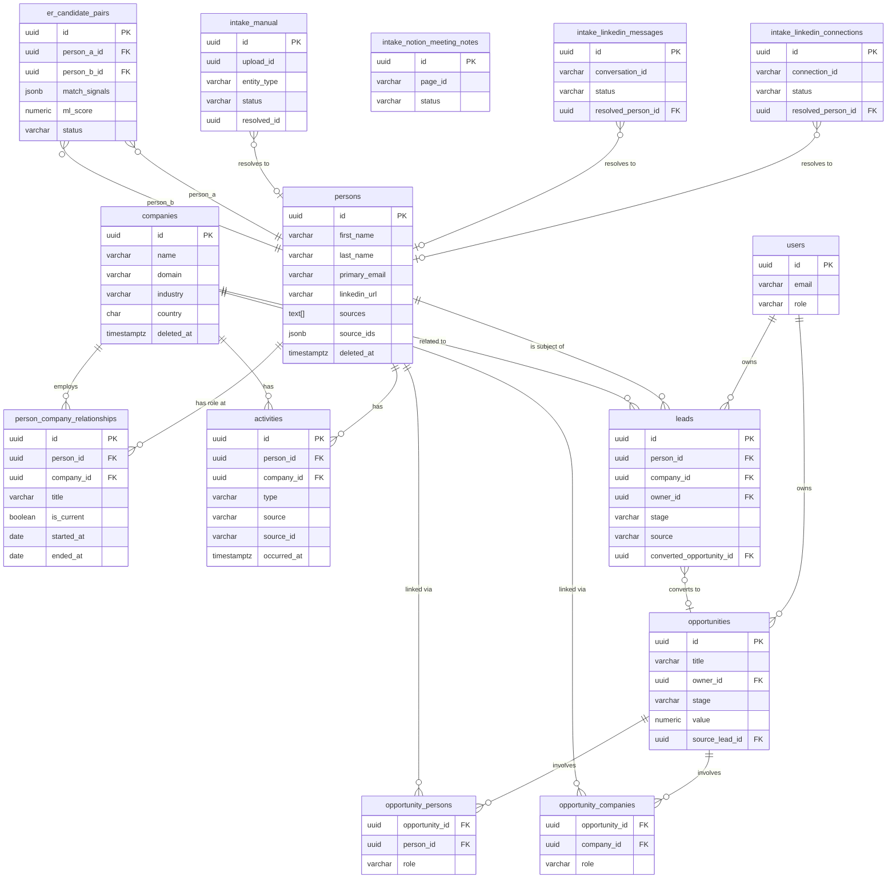

# CDB — Database Schema

**Version**: 0.1 (Draft)
**Status**: Under Review
**Last Updated**: 2026-08-20
**Database**: PostgreSQL 16, database name `cdb`, all tables in `public` schema.

> This document is the definitive schema reference for CDB. Alembic migrations must be generated from this spec. It supersedes the Jager `src/db/sql/cdp_schema.sql` which it replaces.

---

## Entity Relationship Overview



---

## Core Entities

### `users`

Authenticated users of CDB.

```sql
CREATE TABLE users (
    id            UUID PRIMARY KEY DEFAULT gen_random_uuid(),
    email         VARCHAR(255) UNIQUE NOT NULL,
    hashed_pw     VARCHAR(255) NOT NULL,
    full_name     VARCHAR(255),
    role          VARCHAR(32) NOT NULL DEFAULT 'member', -- 'admin' | 'member'
    is_active     BOOLEAN NOT NULL DEFAULT TRUE,
    created_at    TIMESTAMPTZ NOT NULL DEFAULT NOW(),
    updated_at    TIMESTAMPTZ NOT NULL DEFAULT NOW()
);
```

---

### `persons`

The golden record for a natural person. Each row is the result of Entity Resolution merging one or more intake records.

```sql
CREATE TABLE persons (
    id                UUID PRIMARY KEY DEFAULT gen_random_uuid(),

    -- Identity
    first_name        VARCHAR(255),
    last_name         VARCHAR(255),
    primary_email     VARCHAR(255) UNIQUE,
    secondary_emails  JSONB NOT NULL DEFAULT '[]',   -- array of strings
    primary_phone     VARCHAR(100),
    linkedin_url      VARCHAR(2048) UNIQUE,           -- normalised (no scheme/www)
    twitter_handle    VARCHAR(255),
    facebook_id       VARCHAR(255),
    whatsapp_phone    VARCHAR(100),

    -- Location
    city              VARCHAR(255),
    country           CHAR(2),                        -- ISO 3166-1 alpha-2

    -- Profile
    avatar_url        TEXT,
    attributes        JSONB NOT NULL DEFAULT '{}',    -- flexible extra fields

    -- Source tracking
    sources           TEXT[] NOT NULL DEFAULT '{}',  -- e.g. ['linkedin', 'notion']
    source_ids        JSONB NOT NULL DEFAULT '{}',   -- e.g. {"linkedin": "ACoAA..."}

    -- Soft delete
    deleted_at        TIMESTAMPTZ,

    created_at        TIMESTAMPTZ NOT NULL DEFAULT NOW(),
    updated_at        TIMESTAMPTZ NOT NULL DEFAULT NOW()
);

CREATE INDEX idx_persons_primary_email   ON persons (primary_email);
CREATE INDEX idx_persons_linkedin_url    ON persons (linkedin_url);
CREATE INDEX idx_persons_deleted_at      ON persons (deleted_at);
-- Full-text search index
CREATE INDEX idx_persons_fts ON persons
    USING gin(to_tsvector('english', coalesce(first_name,'') || ' ' || coalesce(last_name,'') || ' ' || coalesce(primary_email,'')));
```

**Changes from Jager `cdp.persons`**:
- Removed: `primary_company_id` (replaced by `person_company_relationships`)
- Removed: `status`, `in_linkedin_connections`, `in_substack_subscriber_export`, `person_segment_id`, `person_segment_name`, `person_segment_slug`, `potential_opportunity_types`, `engagement_temperature` (segments are a Phase 4 feature)
- Added: `secondary_emails` (JSONB array), `twitter_handle`, `facebook_id`, `whatsapp_phone`, `source_ids`, `sources`, `deleted_at`

---

### `companies`

An organisation associated with one or more persons.

```sql
CREATE TABLE companies (
    id            UUID PRIMARY KEY DEFAULT gen_random_uuid(),
    name          VARCHAR(255) NOT NULL,
    domain        VARCHAR(255) UNIQUE,               -- e.g. 'acme.com' — deduplication key
    industry      VARCHAR(255),
    size_range    VARCHAR(50),                        -- e.g. '11-50', '51-200', '201-500'
    country       CHAR(2),                            -- ISO 3166-1 alpha-2
    city          VARCHAR(255),
    linkedin_url  VARCHAR(2048),
    avatar_url    TEXT,
    attributes    JSONB NOT NULL DEFAULT '{}',
    deleted_at    TIMESTAMPTZ,
    created_at    TIMESTAMPTZ NOT NULL DEFAULT NOW(),
    updated_at    TIMESTAMPTZ NOT NULL DEFAULT NOW()
);

CREATE INDEX idx_companies_domain     ON companies (domain);
CREATE INDEX idx_companies_deleted_at ON companies (deleted_at);
CREATE INDEX idx_companies_fts ON companies
    USING gin(to_tsvector('english', coalesce(name,'') || ' ' || coalesce(domain,'')));
```

**Changes from Jager `cdp.companies`**:
- Renamed: `company_name` → `name`
- Removed: `status` (company lifecycle status is now tracked via Opportunities, not the company itself)
- Added: `industry`, `size_range`, `city`, `avatar_url`, `deleted_at`

---

### `person_company_relationships`

Many-to-many junction tracking employment history between persons and companies.

```sql
CREATE TABLE person_company_relationships (
    id            UUID PRIMARY KEY DEFAULT gen_random_uuid(),
    person_id     UUID NOT NULL REFERENCES persons(id) ON DELETE CASCADE,
    company_id    UUID NOT NULL REFERENCES companies(id) ON DELETE CASCADE,
    title         VARCHAR(255),                       -- e.g. 'CTO', 'Partner', 'Investor'
    is_current    BOOLEAN NOT NULL DEFAULT TRUE,
    started_at    DATE,
    ended_at      DATE,                               -- NULL if is_current = TRUE
    created_at    TIMESTAMPTZ NOT NULL DEFAULT NOW(),
    updated_at    TIMESTAMPTZ NOT NULL DEFAULT NOW(),

    UNIQUE (person_id, company_id, title)             -- prevent duplicate role entries
);

CREATE INDEX idx_pcr_person_id  ON person_company_relationships (person_id);
CREATE INDEX idx_pcr_company_id ON person_company_relationships (company_id);
CREATE INDEX idx_pcr_is_current ON person_company_relationships (is_current);
```

---

### `activities`

Any recorded interaction between the user and a person or company.

```sql
CREATE TABLE activities (
    id              UUID PRIMARY KEY DEFAULT gen_random_uuid(),
    person_id       UUID REFERENCES persons(id) ON DELETE SET NULL,
    company_id      UUID REFERENCES companies(id) ON DELETE SET NULL,

    type            VARCHAR(50) NOT NULL,             -- 'meeting' | 'email' | 'linkedin_message' | 'whatsapp' | 'call' | 'note'
    source          VARCHAR(100) NOT NULL,            -- 'notion' | 'gmail' | 'linkedin' | 'whatsapp' | 'manual'
    source_id       VARCHAR(512) UNIQUE,              -- external ID for idempotent upsert (NULL for manual entries)

    occurred_at     TIMESTAMPTZ NOT NULL DEFAULT NOW(),
    title           VARCHAR(1024),
    summary         TEXT,
    raw_content     TEXT,
    attributes      JSONB NOT NULL DEFAULT '{}',

    created_at      TIMESTAMPTZ NOT NULL DEFAULT NOW(),
    updated_at      TIMESTAMPTZ NOT NULL DEFAULT NOW(),

    CHECK (person_id IS NOT NULL OR company_id IS NOT NULL) -- must be linked to at least one entity
);

CREATE INDEX idx_activities_person_id    ON activities (person_id);
CREATE INDEX idx_activities_company_id   ON activities (company_id);
CREATE INDEX idx_activities_occurred_at  ON activities (occurred_at DESC);
CREATE INDEX idx_activities_source_id    ON activities (source_id) WHERE source_id IS NOT NULL;
CREATE INDEX idx_activities_type         ON activities (type);
```

---

### `leads`

A person who has shown interest or been identified as a potential target — the qualification layer before a formal Opportunity.

```sql
CREATE TABLE leads (
    id                  UUID PRIMARY KEY DEFAULT gen_random_uuid(),
    person_id           UUID NOT NULL REFERENCES persons(id) ON DELETE CASCADE,
    company_id          UUID REFERENCES companies(id) ON DELETE SET NULL,
    owner_id            UUID REFERENCES users(id) ON DELETE SET NULL,

    stage               VARCHAR(50) NOT NULL DEFAULT 'new',
                        -- 'new' | 'contacted' | 'qualified' | 'converted' | 'disqualified'
    source              VARCHAR(100),                 -- 'linkedin_message' | 'referral' | 'inbound' | 'event' | 'manual'
    source_ref_id       VARCHAR(512),                 -- e.g. LinkedIn conversation ID

    -- Qualification signals
    intent              VARCHAR(255),                 -- e.g. 'open to consulting', 'actively hiring'
    signal_strength     VARCHAR(50),                  -- 'strong' | 'medium' | 'weak'
    notes               TEXT,

    -- Disqualification
    disqualification_reason VARCHAR(255),             -- 'wrong_timing' | 'wrong_fit' | 'no_budget' | 'no_response'

    -- Conversion
    converted_at        TIMESTAMPTZ,
    converted_opportunity_id UUID REFERENCES opportunities(id) ON DELETE SET NULL,

    created_at          TIMESTAMPTZ NOT NULL DEFAULT NOW(),
    updated_at          TIMESTAMPTZ NOT NULL DEFAULT NOW()
);

CREATE INDEX idx_leads_person_id  ON leads (person_id);
CREATE INDEX idx_leads_company_id ON leads (company_id);
CREATE INDEX idx_leads_stage      ON leads (stage);
CREATE INDEX idx_leads_owner_id   ON leads (owner_id);
```

> **Note**: `converted_opportunity_id` has a forward reference to `opportunities`. Add this FK after the `opportunities` table is created, or use a deferred constraint.

**Changes from Jager `cdp.leads`**:
- Removed: `leads_linkedin` and `leads_manual` intake sub-tables (replaced by `intake_linkedin_messages` and `intake_manual`)
- Removed: `conversation_id`, `full_name`, `description`, `message_count`, `summary`, `convo_history`, `opportunity_type`, `rate`, `lead_status_id`, `lead_status_name`, `lead_status_slug`, `lead_stage_*` (lead status is now the `stage` enum)
- Added: `owner_id`, `signal_strength`, `disqualification_reason`, `converted_at`, `converted_opportunity_id`

---

### `opportunities`

A specific, named deal or engagement being actively pursued.

```sql
CREATE TABLE opportunities (
    id                    UUID PRIMARY KEY DEFAULT gen_random_uuid(),
    title                 VARCHAR(512) NOT NULL,
    owner_id              UUID REFERENCES users(id) ON DELETE SET NULL,

    stage                 VARCHAR(50) NOT NULL DEFAULT 'prospect',
                          -- 'prospect' | 'qualified' | 'proposal' | 'negotiation' | 'closed_won' | 'closed_lost'

    value                 NUMERIC(15, 2),             -- optional monetary value
    currency              CHAR(3),                    -- ISO 4217 e.g. 'EUR', 'USD'
    probability           SMALLINT CHECK (probability BETWEEN 0 AND 100),
    expected_close_date   DATE,

    -- Origin
    source_lead_id        UUID REFERENCES leads(id) ON DELETE SET NULL,  -- if converted from a lead

    notes                 TEXT,
    attributes            JSONB NOT NULL DEFAULT '{}',

    created_at            TIMESTAMPTZ NOT NULL DEFAULT NOW(),
    updated_at            TIMESTAMPTZ NOT NULL DEFAULT NOW()
);

CREATE INDEX idx_opportunities_owner_id ON opportunities (owner_id);
CREATE INDEX idx_opportunities_stage    ON opportunities (stage);
```

### `opportunity_persons`

```sql
CREATE TABLE opportunity_persons (
    opportunity_id UUID NOT NULL REFERENCES opportunities(id) ON DELETE CASCADE,
    person_id      UUID NOT NULL REFERENCES persons(id) ON DELETE CASCADE,
    role           VARCHAR(255),                      -- e.g. 'decision_maker', 'champion', 'influencer'
    PRIMARY KEY (opportunity_id, person_id)
);
```

### `opportunity_companies`

```sql
CREATE TABLE opportunity_companies (
    opportunity_id UUID NOT NULL REFERENCES opportunities(id) ON DELETE CASCADE,
    company_id     UUID NOT NULL REFERENCES companies(id) ON DELETE CASCADE,
    role           VARCHAR(255),                      -- e.g. 'client', 'partner', 'vendor'
    PRIMARY KEY (opportunity_id, company_id)
);
```

---

## Intake Tables (Source Layer)

Raw data from external sources lands here before Entity Resolution processes it into master entities. These tables are append-only and idempotent (re-ingesting the same source never creates duplicates).

### `intake_linkedin_connections`

```sql
CREATE TABLE intake_linkedin_connections (
    id              UUID PRIMARY KEY DEFAULT gen_random_uuid(),
    connection_id   VARCHAR(512) UNIQUE NOT NULL,   -- LinkedIn member ID or generated hash
    first_name      VARCHAR(255),
    last_name       VARCHAR(255),
    profile_url     VARCHAR(2048),
    email_address   VARCHAR(255),
    company         VARCHAR(255),
    position        VARCHAR(255),
    connected_at    TIMESTAMPTZ,
    raw_payload     JSONB NOT NULL DEFAULT '{}',
    status          VARCHAR(32) NOT NULL DEFAULT 'pending', -- 'pending' | 'resolved' | 'error'
    resolved_person_id UUID REFERENCES persons(id) ON DELETE SET NULL,
    ingested_at     TIMESTAMPTZ NOT NULL DEFAULT NOW()
);
```

### `intake_linkedin_messages`

```sql
CREATE TABLE intake_linkedin_messages (
    id                  UUID PRIMARY KEY DEFAULT gen_random_uuid(),
    conversation_id     VARCHAR(512) UNIQUE NOT NULL,
    participant_names   TEXT,
    message_count       INTEGER DEFAULT 0,
    raw_content         TEXT,
    raw_payload         JSONB NOT NULL DEFAULT '{}',
    status              VARCHAR(32) NOT NULL DEFAULT 'pending',
    resolved_person_id  UUID REFERENCES persons(id) ON DELETE SET NULL,
    ingested_at         TIMESTAMPTZ NOT NULL DEFAULT NOW()
);
```

### `intake_notion_meeting_notes`

```sql
CREATE TABLE intake_notion_meeting_notes (
    id              UUID PRIMARY KEY DEFAULT gen_random_uuid(),
    page_id         VARCHAR(512) UNIQUE NOT NULL,   -- Notion page ID
    database_name   VARCHAR(255),
    title           VARCHAR(1024),
    meeting_date    TIMESTAMPTZ,
    attendees       TEXT,                           -- raw attendee string; parsed during ER
    summary         TEXT,
    to_dos          JSONB NOT NULL DEFAULT '[]',
    url             TEXT,
    raw_payload     JSONB NOT NULL DEFAULT '{}',
    status          VARCHAR(32) NOT NULL DEFAULT 'pending',
    ingested_at     TIMESTAMPTZ NOT NULL DEFAULT NOW()
);
```

### `intake_manual`

```sql
CREATE TABLE intake_manual (
    id              UUID PRIMARY KEY DEFAULT gen_random_uuid(),
    upload_id       UUID NOT NULL,                  -- groups rows from the same upload batch
    source_label    VARCHAR(255),                   -- user-assigned label e.g. 'Substack export 2026-07'
    entity_type     VARCHAR(50) NOT NULL DEFAULT 'person', -- 'person' | 'company'
    raw_payload     JSONB NOT NULL DEFAULT '{}',   -- full mapped row
    status          VARCHAR(32) NOT NULL DEFAULT 'pending',
    resolved_id     UUID,                           -- FK to persons or companies (polymorphic)
    ingested_at     TIMESTAMPTZ NOT NULL DEFAULT NOW()
);

CREATE INDEX idx_intake_manual_upload_id ON intake_manual (upload_id);
```

---

## Entity Resolution Table

### `er_candidate_pairs`

Stores ambiguous person pairs that couldn't be auto-merged and await user review.

```sql
CREATE TABLE er_candidate_pairs (
    id              UUID PRIMARY KEY DEFAULT gen_random_uuid(),
    person_a_id     UUID NOT NULL REFERENCES persons(id) ON DELETE CASCADE,
    person_b_id     UUID NOT NULL REFERENCES persons(id) ON DELETE CASCADE,
    match_signals   JSONB NOT NULL DEFAULT '{}',    -- e.g. {"name_similarity": 0.91, "email_prefix": true}
    ml_score        NUMERIC(4,3),                   -- 0.000–1.000; NULL until Phase 3 ML runs
    status          VARCHAR(32) NOT NULL DEFAULT 'pending', -- 'pending' | 'accepted' | 'rejected'
    reviewed_by     UUID REFERENCES users(id) ON DELETE SET NULL,
    reviewed_at     TIMESTAMPTZ,
    created_at      TIMESTAMPTZ NOT NULL DEFAULT NOW(),

    UNIQUE (person_a_id, person_b_id),
    CHECK (person_a_id <> person_b_id)
);

CREATE INDEX idx_er_pairs_status ON er_candidate_pairs (status);
```

---

## Enum Reference

These are stored as `VARCHAR` with `CHECK` constraints (not PostgreSQL `ENUM` types, to allow future value additions without migrations).

| Table | Column | Values |
|-------|--------|--------|
| `users` | `role` | `admin`, `member` |
| `activities` | `type` | `meeting`, `email`, `linkedin_message`, `whatsapp`, `call`, `note` |
| `activities` | `source` | `notion`, `gmail`, `linkedin`, `whatsapp`, `manual` |
| `leads` | `stage` | `new`, `contacted`, `qualified`, `converted`, `disqualified` |
| `leads` | `signal_strength` | `strong`, `medium`, `weak` |
| `opportunities` | `stage` | `prospect`, `qualified`, `proposal`, `negotiation`, `closed_won`, `closed_lost` |
| `intake_*` | `status` | `pending`, `resolved`, `error` |
| `er_candidate_pairs` | `status` | `pending`, `accepted`, `rejected` |

---

## Migration Notes (from Jager CDP)

| Jager table | CDB table | Notes |
|-------------|-----------|-------|
| `cdp.persons` | `persons` | Schema redesigned — see field diff above |
| `cdp.companies` | `companies` | `company_name` → `name`; `status` removed |
| `cdp.person_company_relationships` | `person_company_relationships` | Largely unchanged |
| `cdp.activities` | `activities` | `activity_type` → `type`; `activity_date` → `occurred_at` |
| `cdp.activities_notion_meeting_notes` | `intake_notion_meeting_notes` | Promoted to intake layer |
| `cdp.leads` | `leads` | Major redesign — see field diff above |
| `cdp.leads_linkedin` | `intake_linkedin_messages` | Promoted to intake layer |
| `cdp.leads_manual` | `intake_manual` | Promoted to intake layer |
| `cdp.persons_linkedins` | `intake_linkedin_connections` | Renamed; `status` + `resolved_person_id` added |
| `cdp.persons_manual_substack` | `intake_manual` | Merged into generic intake_manual |
| `cdp.engagements` | *(removed)* | Merged into `activities` |
| `cdp.person_segments` | *(Phase 4)* | Segments feature deferred |
| `cdp.lead_statuses` | *(removed)* | Replaced by `leads.stage` enum |

---

*See [Implementation_plan.md](Implementation_plan.md) for tech stack and migration execution plan.*
