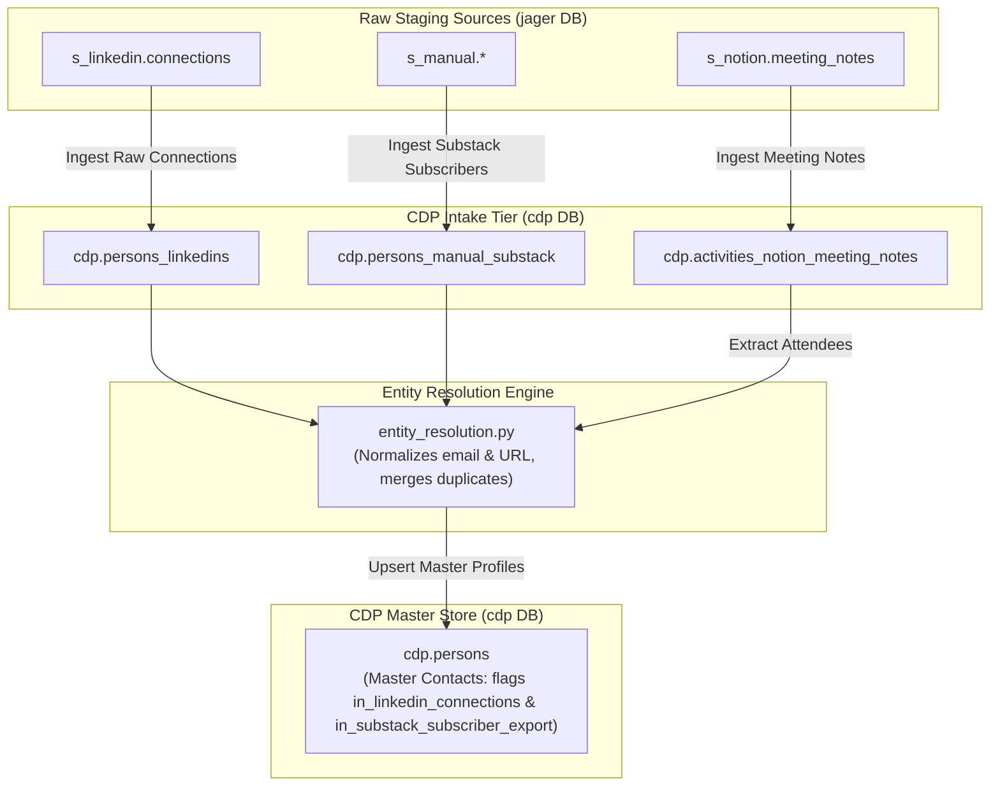
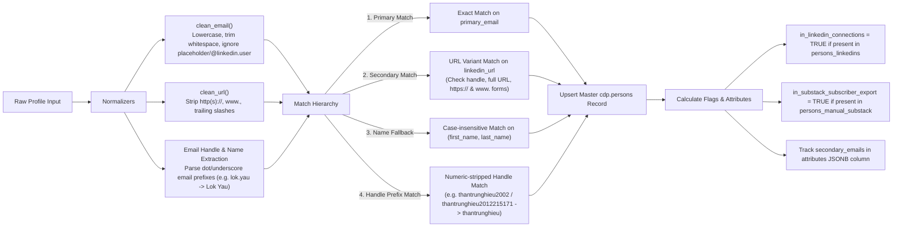
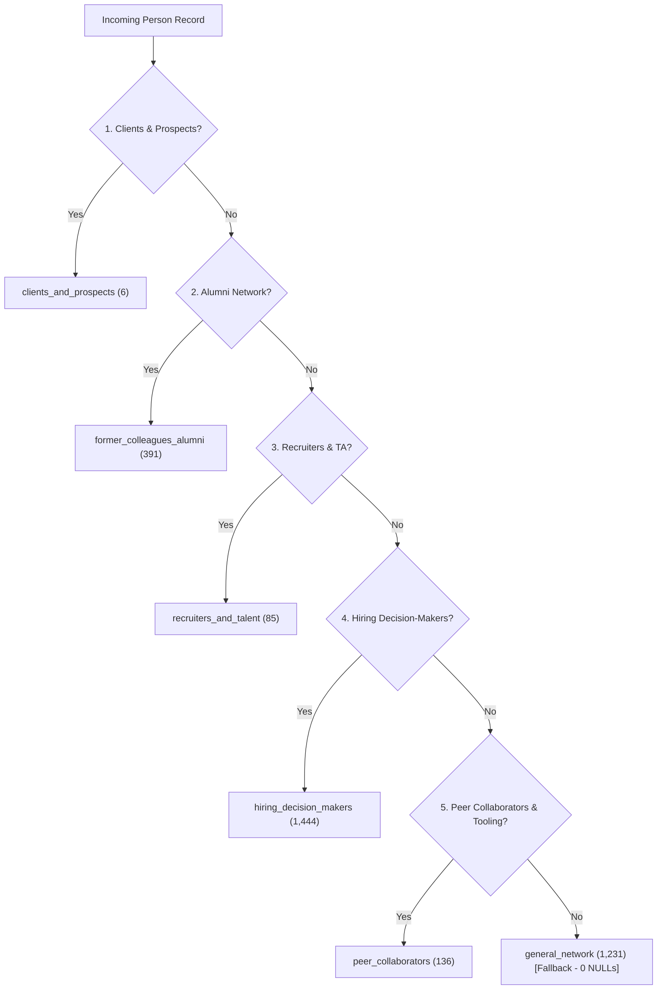
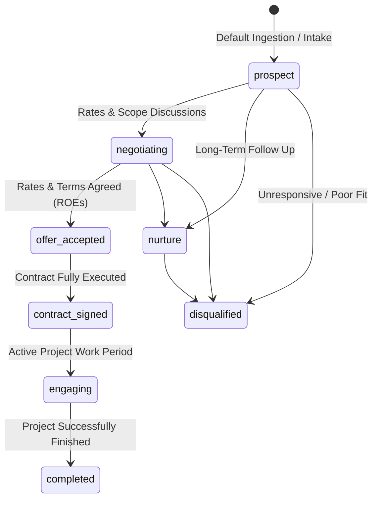
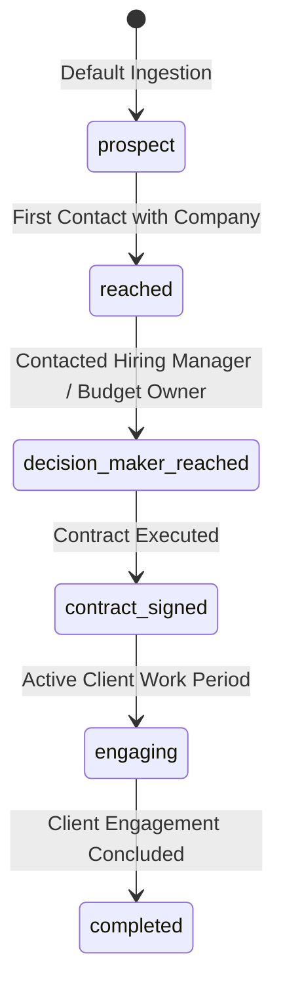

# Customer / Client Data Platform (CDP) Service

The **CDP Service** is a dedicated FastAPI microservice responsible for core Customer/Client Data Platform processing in Jager.

A Customer Data Platform (CDP) acts as the unified system of record for managing all **Leads** (`cdp.leads`, with specialized intake tables `cdp.leads_linkedin` and `cdp.leads_manual`), **Persons/Contacts** (`cdp.persons`), **Companies** (`cdp.companies`), **Person-Company Relationships** (`cdp.person_company_relationships`), and **Client Engagements / Activities** (`cdp.engagements`, `cdp.activities`). Similar to enterprise platforms like Snowplow or Braze, it provides a centralized, 360-degree overview of client interactions and ongoing project engagements.

---

## Core Domain Model & Responsibilities

Unlike analytical ETL pipelines (which live under `src/data_pipelines/` for loading MotherDuck OLAP tables), the CDP service executes core operational domain logic directly on the PostgreSQL `cdp` schema.

### Key Functional Domains:
1. **Entities & Identity Resolution**:
   - **`cdp.persons_linkedins`**: Dedicated intake table for raw LinkedIn contact/connection profiles (`s_linkedin.connections`).
   - **`cdp.persons_manual_substack`**: Dedicated intake table for raw Substack subscriber export contacts (`s_manual`).
   - **`cdp.persons`**: Consolidated master contact table representing single resolution outcomes resolved across intake sources and meeting note attendees by primary email or LinkedIn URL.
   - **`cdp.companies`**: Target client companies, organizations, and accounts extracted from sources (e.g. LinkedIn connections).
   - **`cdp.person_company_relationships`**: Mapping individual contacts to client accounts with specific roles (e.g. decision maker, job position) and employment status.
2. **Lead Intake & Opportunity Lifecycle**:
   - **`cdp.leads_linkedin`**: Intake table for LinkedIn message-derived leads (`s_linkedin.messages`).
   - **`cdp.leads_manual`**: Intake table for manual data-derived leads (`s_manual`).
   - **`cdp.leads`**: Aggregated physical table consolidating LinkedIn and Manual leads, featuring a `source` column (`Linkedin` or `Manual`).
3. **Activities Domain**:
   - **`cdp.activities_notion_meeting_notes`**: Intake table sourced from Notion meeting notes (`s_notion.meeting_notes`).
   - **`cdp.activities`**: Consolidated activity entity table, populated solely from `cdp.activities_notion_meeting_notes` (extensible to future activity sources).
4. **Client Engagement & Activity Overview**:
   - **`cdp.engagements`**: Activity log tracking touchpoints (emails, calls, meetings, notes, form submissions, LinkedIn messages) for complete client engagement visibility.
5. **Segmentation & Engagement Temperature Engine**:
   - **`cdp.person_segments`**: Dimension table for Opportunity-Based contact segments (`clients_and_prospects`, `former_colleagues_alumni`, `recruiters_and_talent`, `hiring_decision_makers`, `peer_collaborators`, `general_network`). Referenced via `cdp.persons.person_segment_id`.
   - **`cdp.persons.potential_opportunity_types`**: Denormalized opportunity types column describing target collaboration models.
   - **`cdp.persons.engagement_temperature`**: Dynamic engagement score (`hot` [30d], `warm` [90d], `dormant` [>90d], `cold` [no activity]).
   - **`cdp.lead_statuses`**: Dimension table for opportunity/pipeline statuses. Referenced via `cdp.leads.lead_status_id`.
6. **Automation Endpoints**:
   - Exposes REST HTTP endpoints consumed by n8n workflows (accessed via `CDP_SERVICE_URL`, e.g. `http://cdp:8000`).

---

## Data Flow Architecture



---

## Entity Resolution Mechanism (`entity_resolution.py`)

The CDP Entity Resolution engine consolidates multi-source intake contacts (`cdp.persons_linkedins`, `cdp.persons_manual_substack`, and `cdp.activities_notion_meeting_notes`) into single master entities in `cdp.persons`.



### Key Entity Resolution Rules:
1. **Email Normalization & Name Extraction**: Standardizes email addresses (lowercasing, trimming whitespace), filters placeholder emails (e.g. `@linkedin.user`), and automatically derives missing first/last names from structured email username prefixes (e.g. `lok.yau@...` -> `Lok Yau`).
2. **URL Variation Normalization**: Strips `http://`, `https://`, `www.`, and trailing slashes to create a canonical profile handle. Database lookups match across full URL variations (`https://www.linkedin.com/in/...`, `linkedin.com/in/...`).
3. **Deterministic Match Hierarchy**:
   - **Stage 1 (Primary)**: Matches existing contact by `primary_email`.
   - **Stage 2 (Secondary)**: Matches existing contact by `linkedin_url` (across all URL variations).
   - **Stage 3 (Name Fallback)**: Matches existing contact by case-insensitive `(first_name, last_name)`.
   - **Stage 4 (Handle Prefix Match)**: Strips trailing numeric digits from email handles (e.g., `thantrunghieu2002` / `thantrunghieu2012215171` -> `thantrunghieu`) to unify personal and institutional emails belonging to the same individual.
4. **Attribute Merging & Secondary Emails**: When a match occurs, missing profile attributes (first name, last name, phone, country) are non-destructively merged via `COALESCE`. Additional alternate email addresses are preserved inside the `attributes` JSONB column as `{"secondary_emails": ["..."]}`.
5. **Presence Flags**:
   - `in_linkedin_connections`: Dynamically set to `TRUE` if the contact originates from or matches a LinkedIn connection profile.
   - `in_substack_subscriber_export`: Dynamically set to `TRUE` if the contact originates from or matches a Substack subscriber export.

---

## 🎯 CDP Segmentation & Engagement Temperature Architecture

The CDP segmentation engine operates under four core principles tailored for a Data Biz Consultancy network:

1. **Mutually Exclusive Classification**: Every contact in `cdp.persons` has a single primary `person_segment_id` (FK to `cdp.person_segments`), `person_segment_name`, `person_segment_slug`, and `potential_opportunity_types`.
2. **Zero NULLs Policy**: Unclassified contacts automatically fall back into the `general_network` ("General Network") segment.
3. **Denormalized Human-Readable Columns**: Direct `person_segment_name`, `person_segment_slug`, `potential_opportunity_types`, `lead_status_name`, and `lead_status_slug` columns exist on `cdp.persons` and `cdp.leads` to eliminate required SQL JOINs in quick reporting or downstream applications.
4. **Strict Priority Hierarchy**: Person segments evaluate in a strict priority cascade so higher-trust or high-intent segments take precedence over broader categories.

### 👥 Person Segments (Opportunity-Based Framework)

`cdp.persons` evaluates across 6 opportunity-based segments in the following priority order:



#### Segment Definitions & Rules

| Priority | Slug | Segment Name | Target Persona & Description | Potential Opportunity Types | Live Count |
| :---: | :--- | :--- | :--- | :--- | :---: |
| **1** | `clients_and_prospects` | **Clients & Prospects** | Warm consulting lead opportunities, AI exploration (e.g. Micheala Sawyer, Juned Kadiwala, Jodi Barrow), & meeting contacts | Consulting Projects, Advisory, Fractional Data Leadership | **216** |
| **2** | `former_colleagues_alumni` | **Alumni & Former Colleagues** | High-trust alumni network contacts (Hays, HelloFresh, Delivery Hero, Foodpanda, Vestiaire) | Referrals, Re-hiring, Warm Client Introductions, Partnering | **379** |
| **3** | `recruiters_and_talent` | **Recruiters & Talent Acquisition** | Talent acquisition managers, recruiters, HR managers (e.g. Katharina Kern), headhunters | Full-Time Employment, Contract Roles, Fractional Opportunities | **68** |
| **4** | `hiring_decision_makers` | **Hiring Decision-Makers** | C-Level executives, Founders, VPs, Directors, Heads of Data/Eng, Leads, Managers | Consulting Projects, Full-Time Employment, Fractional Leadership | **1,349** |
| **5** | `peer_collaborators` | **Peer Collaborators & Agencies** | Agency owners, consultants, freelancers, tooling partners (dltHub, MotherDuck, n8n), DevRel | Project Subcontracting, Co-bidding, Client Referrals, Tooling Implementations | **122** |
| **6** | `general_network` | **General Network** | Fallback segment for all general network contacts & audience members | Brand Awareness, Audience Engagement, Content Reach | **1,245** |

---

### 🌡️ Engagement Temperature Scoring

Every person in `cdp.persons` is dynamically scored with an `engagement_temperature` value:

| Temperature | Icon | Scoring Rules & Criteria | Live Count |
| :--- | :---: | :--- | :---: |
| **`hot`** | 🔥 | Recorded touchpoint in `cdp.engagements` or activity in `cdp.activities` within the **last 30 days**. | **0** |
| **`warm`** | ☀️ | Touchpoint/activity within the **last 90 days** OR active in Substack subscriber export / LinkedIn connections. | **3,124** |
| **`dormant`** | 💤 | Has recorded past touchpoints/activities, but **no activity in the last 90+ days**. | **0** |
| **`cold`** | ❄️ | Zero recorded touchpoints or activities. | **169** |

---

### 💼 Lead Statuses & Funnel Stages

`cdp.lead_statuses` stores the 8 canonical lead lifecycle stages mapped to 3 high-level marketing/sales funnel stages (`awareness`, `consideration`, `conversion`), alongside an `is_end_state` terminal flag:

| Slug | Lead Status Name | Funnel Stage (`stage`) | Is End State (`is_end_state`) | Description & Lifecycle Trigger |
| :--- | :--- | :---: | :---: | :--- |
| `prospect` | **Prospect** | `awareness` | `FALSE` | Default state upon lead intake/ingestion. No negotiation initiated yet. |
| `nurture` | **Nurture** | `awareness` | `FALSE` | Long-term follow up or delayed opportunity. |
| `negotiating` | **Negotiating** | `consideration` | `FALSE` | Rates, scope, or ROE discussions underway. |
| `offer_accepted` | **Offer Accepted** | `consideration` | `FALSE` | Rates and terms agreed; awaiting contract execution. |
| `contract_signed` | **Contract Signed** | `conversion` | `FALSE` | Contract fully executed and signed. |
| `engaging` | **Engaging** | `conversion` | `FALSE` | Active project work period. |
| `completed` | **Completed** | `NULL` | `TRUE` | Terminal state: Project or consulting engagement successfully finished. |
| `disqualified` | **Disqualified** | `NULL` | `TRUE` | Terminal state: Unresponsive, poor fit, or lost opportunity. |

---

## Status Lifecycles & State Transitions

### 1. Lead Opportunity Status Lifecycle (`cdp.leads.status`)

The `cdp.leads` table tracks business opportunity leads. The status follows an 8-stage lifecycle from initial intake/prospecting to rate negotiation, contract execution, active engagement, nurture, or disqualification.



#### Lead Stage Definitions (`cdp.leads.status`)

| Status Value | Stage Name | Description & Trigger Criteria |
| :--- | :--- | :--- |
| `prospect` | **Prospect** | Default state upon lead intake/ingestion. No negotiation initiated yet. |
| `negotiating` | **Negotiating** | Active negotiations around project scope, daily rate (EUR/day), and contract terms. |
| `offer_accepted` | **Offer Accepted** | Both sides agree on daily rate and Rules of Engagement (ROEs) before formal contract signing. |
| `contract_signed` | **Contract Signed** | MSA / SOW contract fully signed and executed. |
| `engaging` | **Actively Engaging** | Currently executing active project work during the engagement period. |
| `completed` | **Engagement Completed** | Project engagement successfully completed. |
| `nurture` | **Nurture** | Lead is not cold, but not yet ready for immediate negotiation; periodic follow-up. |
| `disqualified` | **Disqualified** | Catch-all state for disqualified, unresponsive, or unviable leads. |

---

### 2. Company Status Lifecycle (`cdp.companies.status`)

The `cdp.companies` table represents target organizations. It follows a streamlined 6-stage lifecycle tracking the overall company-level relationship.



#### Company Stage Definitions (`cdp.companies.status`)

| Status Value | Stage Name | Description & Trigger Criteria |
| :--- | :--- | :--- |
| `prospect` | **Prospect** | Default state upon company ingestion. No active contact established yet. |
| `reached` | **Reached** | Initial contact established with company representative(s). |
| `decision_maker_reached` | **Decision Maker Reached** | Contact established with key stakeholder who owns budget or hires for roles. |
| `contract_signed` | **Contract Signed** | Formal organization-level contract / SOW signed. |
| `engaging` | **Actively Engaging** | Company currently has active ongoing engagement/work. |
| `completed` | **Completed** | Company engagement successfully finished. |

---

## Directory Structure

```text
src/cdp/
├── Dockerfile                  # Container definition for CDP service
├── requirements.txt            # Python dependencies (FastAPI, SQLAlchemy, psycopg2)
├── main.py                     # FastAPI application endpoints
├── utils.py                    # Database connection & logging helpers
└── processors/                 # Core domain processors & handlers
    ├── entity_resolution.py             # Consolidated identity resolution engine merging intake tables into cdp.persons
    ├── evaluate_segments.py             # Evaluates dynamic segment rules and refreshes person and lead segment memberships
    ├── process_linkedin_connections.py  # Ingests LinkedIn connections into cdp.persons_linkedins, cdp.companies, and triggers entity resolution
    ├── process_linkedin_messages.py     # Processes s_linkedin.messages into cdp.leads_linkedin and cdp.leads
    ├── process_manual_data.py           # Ingests s_manual tables into cdp.persons_manual_substack, cdp.leads_manual, cdp.leads, and triggers entity resolution
    └── process_notion_meeting_notes.py  # Ingests Notion meeting notes into cdp.activities_notion_meeting_notes and triggers entity resolution
```

---

## API Endpoints

* `GET /health`: Service health check.
* `POST /process/linkedin_connections`: Runs the processor to normalize raw connections from `s_linkedin.connections` into `cdp.persons`, `cdp.companies`, and `cdp.person_company_relationships`.
* `POST /process/manual_data`: Runs the processor to extract and normalize manual data ingestion tables from `s_manual` schema into `cdp.leads`, `cdp.persons`, and `cdp.companies`.
* `POST /process/linkedin_messages`: Runs the processor to extract and normalize LinkedIn messages into `cdp.leads_linkedin` and `cdp.leads`.
* `POST /process/notion_meeting_notes`: Ingests Notion meeting notes from `s_notion.meeting_notes` into `cdp.activities_notion_meeting_notes` and populates `cdp.activities`.
* `POST /process/evaluate_segments`: Evaluates dynamic rule criteria across `cdp.person_segments` and `cdp.lead_segments` and updates membership junction tables.

---

## Running & Testing

### Docker Service
The CDP service runs on port 8000 as part of Docker Compose:
```bash
docker compose up --build cdp
```

### Automated Unit Tests
Run unit tests via `pytest`:
```bash
uv run pytest tests/cdp/
```
