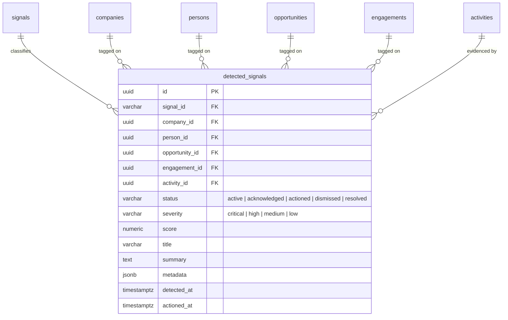

# CDB — Opportunity & Risk Signal Catalog

## Overview

The **Opportunity & Risk Signal Catalog** defines the standard business event ontology in CDB for detecting high-impact commercial opportunities and relationship risks across contacts, client companies, pipeline deals, and active engagements.

Signals are modeled as a first-class **PostgreSQL dimension table** (`signals`), adhering to the dimensional design pattern established by `person_actions` and `opportunity_actions`.

---

## Architecture & Data Flow

```
   ┌─────────────────────────────────────────────────────────────┐
   │             PostgreSQL Dimension Table: `signals`           │
   │  (slug PK, name, category, target_entity, severity,         │
   │   business_interpretation, parameters, recommended_action)   │
   └──────────────────────────────┬──────────────────────────────┘
                                  │
                                  ▼
   ┌─────────────────────────────────────────────────────────────┐
   │     Service Layer: `cdb.services.signals.catalog`           │
   │  - get_signals_from_db(category, target_entity, severity)   │
   │  - get_signal_by_id(signal_id)                              │
   │  - compute_catalog_summary(signals)                         │
   │  - ensure_signals_dimension(db)                             │
   └──────────────────────────────┬──────────────────────────────┘
                                  │
                                  ▼
   ┌─────────────────────────────────────────────────────────────┐
   │     FastAPI Router: `/api/v1/signals/catalog`               │
   │  - GET /api/v1/signals/catalog                              │
   │  - GET /api/v1/signals/catalog/{signal_id}                  │
   └─────────────────────────────────────────────────────────────┘
```

---

## Signal Catalog Taxonomy

| Signal ID | Name | Category | Target Entity | Severity | Detection Mechanism |
| :--- | :--- | :--- | :--- | :--- | :--- |
| `dormant_strategic_account` | Dormant Strategic Account | `risk` | `company` | `high` | `temporal_cadence` |
| `unanswered_conversation` | Unanswered Conversation | `risk` | `person` | `critical` | `temporal_cadence` |
| `expiring_contract` | Expiring Contract | `hybrid` | `engagement` | `high` | `temporal_cadence` |
| `leadership_change` | Leadership Change | `hybrid` | `person` | `high` | `deterministic_rule` |
| `hiring_funding_event` | Hiring or Funding Event | `opportunity` | `company` | `medium` | `text_pattern` |
| `competitor_signal` | Competitor Signal | `risk` | `opportunity` | `high` | `text_pattern` |

---

## Detailed Signal Definitions & Business Interpretations

### 1. `dormant_strategic_account`
* **Name**: Dormant Strategic Account
* **Category**: `risk`
* **Target Entity**: `company`
* **Severity**: `high` (Default) / `critical` (if > 90 days inactive)
* **Business Interpretation**:
  In consulting and advisory, repeat business and account expansion represent 60–80% of revenue. When a strategic account becomes dormant, relationship context atrophies, executive sponsors drift away, and competitors can penetrate the account without visibility. Dormancy is the leading indicator of client churn.
* **Trigger Criteria**:
  * Qualifying conditions: Company has a signed engagement, won opportunity, or belongs to the `clients_and_prospects` segment.
  * Inactivity thresholds: No recorded activity (meeting, call, message) in `warning_days: 60` or `critical_days: 90`.
* **Recommended Action**:
  * **Playbook**: `executive_touchpoint` (`schedule_sync`)
  * **Title**: Schedule Executive Check-In or QBR
  * **Description**: Reach out to past client sponsors with a relevant industry benchmark, new architectural case study, or offer a complimentary advisory check-in.

---

### 2. `unanswered_conversation`
* **Name**: Unanswered Conversation
* **Category**: `risk`
* **Target Entity**: `person`
* **Severity**: `critical`
* **Business Interpretation**:
  Lead conversion probability and client trust decline precipitously with response latency. Dropping an inbound thread or failing to follow up on a meeting action item signals operational slack, forfeits deal momentum, and severely harms professional credibility.
* **Trigger Criteria**:
  * Inbound message received via LinkedIn, email, or WhatsApp where the last sender was the external contact.
  * No outbound reply or activity within `warning_days: 3` (Warning) or `critical_days: 7` (Critical SLA breach).
  * Open to-do items from Notion meeting debriefs older than 5 days.
* **Recommended Action**:
  * **Playbook**: `rapid_response` (`send_message`)
  * **Title**: Reply to Open Thread
  * **Description**: Triage the unanswered message thread immediately; draft and send a thoughtful reply or schedule the requested call.

---

### 3. `expiring_contract`
* **Name**: Expiring Contract
* **Category**: `hybrid` (Opportunity for renewal/upsell + Risk of revenue cliff)
* **Target Entity**: `engagement`
* **Severity**: `high`
* **Business Interpretation**:
  Fixed-term consulting contracts require renewal lead time. If extension discussions do not commence 30–60 days prior to contract expiration, client procurement cycles and quarterly budget reallocations cause billable interruptions or account loss. It also represents the prime window for scope expansion and rate reviews.
* **Trigger Criteria**:
  * `contract_status == 'signed'` and `status in ('active', 'in_delivery')`.
  * `expected_end_date` within `early_warning_days: 60` or `urgent_renewal_days: 30`.
* **Recommended Action**:
  * **Playbook**: `contract_renewal` (`prepare_proposal`)
  * **Title**: Initiate Contract Renewal & Scope Review
  * **Description**: Schedule a project wrap/renewal milestone meeting with the delivery sponsor; prepare an extension Statement of Work (SOW) or retainer expansion proposal.

---

### 4. `leadership_change`
* **Name**: Leadership Change
* **Category**: `hybrid` (Risk of lost champion + Opportunity at new account)
* **Target Entity**: `person`
* **Severity**: `high`
* **Business Interpretation**:
  B2B consulting services are bought by people, not logos. When an internal champion departs, ongoing projects and future renewals are vulnerable to budget freezes. Conversely, a champion joining a new company creates an immediate warm pipeline, while a newly hired executive at a target account brings a fresh mandate and budget for change.
* **Trigger Criteria**:
  * Key stakeholder role ends at an active client account (`is_current = False`).
  * New executive affiliation added with executive title (`CTO`, `VP`, `Head of`, `Director`) within the last 60 days.
* **Recommended Action**:
  * **Playbook**: `stakeholder_remapping` (`outreach_and_mapping`)
  * **Title**: Congratulate Transitioned Leader & Map Successor
  * **Description**: If a champion moved, congratulate them at their new firm to explore new opportunities; concurrently identify and build rapport with the incoming successor at the client account.

---

### 5. `hiring_funding_event`
* **Name**: Hiring or Funding Event
* **Category**: `opportunity`
* **Target Entity**: `company`
* **Severity**: `medium`
* **Business Interpretation**:
  Fresh capital investment (Seed, Series A/B, PE) or aggressive hiring in data and AI signals strategic expansion coupled with urgent execution pressure. Because hiring permanent engineers takes 3 to 6 months, these accounts experience acute capacity bottlenecks where high-impact advisory or specialized consulting can immediately accelerate timelines.
* **Trigger Criteria**:
  * Inbound messages or Notion meeting debriefs containing funding keywords (`"seed"`, `"series a"`, `"raised"`, `"funding round"`) or hiring keywords (`"hiring data"`, `"growing the team"`, `"analytics engineer"`).
  * Company attribute updates reflecting funding or headcount growth.
* **Recommended Action**:
  * **Playbook**: `growth_acceleration` (`tailored_pitch`)
  * **Title**: Pitch Rapid Delivery & Capability Acceleration
  * **Description**: Reach out to technical leadership with a tailored proposal offering team augmentation or architectural roadmap sprint during their growth phase.

---

### 6. `competitor_signal`
* **Name**: Competitor Signal
* **Category**: `risk`
* **Target Entity**: `opportunity`
* **Severity**: `high`
* **Business Interpretation**:
  Competitor presence in an active deal or client account introduces margin pressure, extended evaluation cycles, and displacement risk. Early detection enables proactive value re-framing, stakeholder alignment, and deployment of differentiation battlecards before procurement decisions crystallize.
* **Trigger Criteria**:
  * Interactions, meeting debriefs, or opportunity notes mentioning rival consultancies or keywords like `"talking to another"`, `"evaluating alternative"`, `"competing proposal"`, `"bake-off"`, `"RFP"`, `"cheaper alternative"`.
  * Lead disqualification reason referencing competitor choice.
* **Recommended Action**:
  * **Playbook**: `competitive_defense` (`battlecard_activation`)
  * **Title**: Activate Competitive Battlecard & Re-anchor Value
  * **Description**: Review competitor differentiation matrix; schedule an alignment call with the executive sponsor emphasizing unique consulting ROI, rapid time-to-value, and specialized architecture expertise.

---

## API Endpoints

### List Catalog
`GET /api/v1/signals/catalog`

Query Parameters:
- `category` (`opportunity`, `risk`, `hybrid`): Filter by category
- `target_entity` (`company`, `person`, `opportunity`, `engagement`): Filter by entity
- `severity` (`critical`, `high`, `medium`, `low`): Filter by severity
- `active_only` (default: `true`): Filter to active signals

Example Response:
```json
{
  "data": [
    {
      "id": "dormant_strategic_account",
      "name": "Dormant Strategic Account",
      "category": "risk",
      "target_entity": "company",
      "severity": "high",
      "detection_mechanism": "temporal_cadence",
      "description": "Identifies valuable or strategic accounts with no recorded interactions over an extended period.",
      "business_interpretation": "In consulting and advisory, repeat business and account expansion represent 60-80% of revenue...",
      "parameters": {
        "warning_days": 60,
        "critical_days": 90,
        "qualifying_criteria": ["has_signed_engagement", "has_closed_won_opportunity"]
      },
      "recommended_action": {
        "playbook": "executive_touchpoint",
        "action_type": "schedule_sync",
        "title": "Schedule Executive Check-In or QBR",
        "description": "Reach out to past client sponsors..."
      },
      "icon": "💤",
      "color": "amber",
      "is_active": true
    }
  ],
  "summary": {
    "total_signals": 6,
    "by_category": {
      "risk": 3,
      "opportunity": 1,
      "hybrid": 2
    },
    "by_target_entity": {
      "company": 2,
      "person": 2,
      "engagement": 1,
      "opportunity": 1
    },
    "by_severity": {
      "high": 4,
      "critical": 1,
      "medium": 1
    }
  }
}
```

### Get Single Signal
`GET /api/v1/signals/catalog/{signal_id}`

Returns the full `SignalDefinition` or `404 NOT_FOUND`.

---

## Detection Engine & `detected_signals` Bridge Table

While `signals` provides the **dimension catalog** of signal definitions, the **`detected_signals`** table acts as the **central fact/bridge table** linking active and historical signal events to core business entities:



### Detection Engine (`detectors/` package)

The detection engine has been refactored from a single `detector.py` into focused sub-modules:

| Module | Responsibility |
| :--- | :--- |
| `classification/rules.py` | Classification rule definitions & canonical catalog rules (`SIGNAL_CLASSIFICATION_RULES`) |
| `classification/confidence.py` | Confidence scoring thresholds & heuristics (`assess_confidence`, `SignalConfidenceTier`) |
| `classification/evidence.py` | Supporting evidence contracts & metadata builders (`build_evidence_payload`, `build_signal_meta`) |
| `classification/polarity.py` | Signal polarity enums & dynamic resolution (`SignalPolarity`, `resolve_signal_effective_polarity`) |
| `classification/conflicts.py` | Multi-entity conflict detection across Company, Opportunity, Person scopes (`detect_signal_conflicts`) |
| `classification/__init__.py` | Classification package facade re-exporting all rules, metrics, and contracts |
| `patterns.py` | Compiled regex constants (`COMMERCIAL_OPPORTUNITY_REGEX`, `FUNDING_REGEX`, `COMPETITOR_REGEX`, etc.) |
| `utils/dates.py` | Date and timezone normalization utilities (`ensure_utc`) |
| `utils/activity.py` | Activity parsing and participant extraction (`extract_activity_persons`) |
| `utils/account.py` | Account resolution utilities (`resolve_account_for_signal`) traversing entity graphs |
| `utils/enrichment.py` | Context enrichment (`enrich_company_context`) and employee sanitization (`sanitize_target_persons`) |
| `utils/matching.py` | Active signal lookup and query builder (`find_existing_active_signal`) |
| `utils/persistence.py` | Signal record creation and update handling (`persist_signal_record`) |
| `utils/linking.py` | Participant person link creation and role assignment (`link_signal_persons`) |
| `utils/upsert.py` | Master persistence and deduplication coordinator (`upsert_detected_signal`) |
| `utils/__init__.py` | Utility package exports with public and backward-compatible private aliases |
| `detectors/dormant.py` | `detect_dormant_strategic_accounts` |
| `detectors/unanswered/query.py` | Candidate inbound conversation querying awaiting response |
| `detectors/unanswered/signal.py` | Signal creation, evidence building, and persistence for unanswered threads |
| `detectors/unanswered/__init__.py` | Unanswered conversation detector facade |
| `detectors/contracts.py` | `detect_expiring_contracts` |
| `detectors/leadership/signal.py` | Signal payload and metadata builder for leadership transitions |
| `detectors/leadership/departures.py` | Champion departure detection from strategic accounts |
| `detectors/leadership/arrivals.py` | Executive arrival/joiner detection across client/prospect accounts |
| `detectors/leadership/__init__.py` | Leadership change detector facade coordinating departures and arrivals |
| `detectors/growth/activities.py` | Unstructured interaction text scanning for funding & hiring events |
| `detectors/growth/enrichment.py` | Structured `Company.attributes` evaluation for funding & headcount growth |
| `detectors/growth/__init__.py` | Growth detector facade coordinating activities and enrichment pipelines |
| `detectors/competitors/constants.py` | Known competitor consultancy lists & high-intent bake-off indicators |
| `detectors/competitors/signal.py` | Competitor threat signal builder, confidence assessment, and persistence |
| `detectors/competitors/__init__.py` | Competitor threat detector facade |
| `orchestrator.py` | `evaluate_all_signals` — wires all detectors, stale signal retirement, conflict detection |
| `detector.py` | Thin re-export shim for backward-compatible imports |


1. **`dormant_strategic_account`**: Scans companies qualifying as strategic (signed engagement, won deal, or strategic tier/segment attributes) where `MAX(activity.occurred_at)` is older than 60 days (or no activity).
2. **`unanswered_conversation`**: Scans inbound messages (LinkedIn, email, WhatsApp) where the external contact was the last sender > 3 days ago without an outbound response within the lookback window (default 90 days). Strictly filters out routine inbox noise by requiring commercial gig/project opportunity context (proposals, budget, rates, consulting/advisory engagement) or competitor bake-off mentions. Resolves contact's current company via `PersonCompanyRelationship`.
3. **`expiring_contract`**: Scans active signed engagements where `expected_end_date` is within 60 days ($\le 30\text{d}$ high risk, $31-60\text{d}$ renewal opportunity).
4. **`leadership_change`**: Scans relationship ends in lookback window (champion departures) and new executive relationships in lookback window.
5. **`hiring_funding_event`**: Scans both unstructured touchpoint activities (within lookback window matching capital/hiring keywords) and structured account enrichment data (`Company.attributes` for funding rounds, capital amounts, and headcount growth rates).
6. **`competitor_signal`**: Scans activity texts and opportunity notes for active competitor evaluation or RFP bake-off mentions within the lookback window, resolving affected account via `OpportunityCompany`, `Engagement`, or `Person`.

### User-Configurable Lookback Window & Noise Control
- Detection sweeps support a configurable `lookback_days` parameter (`90` days / 3 months default, `180` days / 6 months, `365` days / 1 year, and up to `730` days / 2 years max).
- When a detection sweep is triggered with a lookback window, signals outside the window or whose criteria are no longer met are automatically retired (`status = 'dismissed'`), keeping the active signal queue fresh, focused, and free of historical noise.

### Guaranteed Affected Account Attribution & Resolution
- All detected signals strictly guarantee affected account attribution (`company_id` and `company_name`):
  - **Direct Company Signals**: (`dormant_strategic_account`, `hiring_funding_event`) directly associate `company_id`.
  - **Person Signals**: (`unanswered_conversation`, `leadership_change`) resolve the contact's current organization via `PersonCompanyRelationship.is_current == True` (or most recent employment).
  - **Engagement Signals**: (`expiring_contract`) resolve `engagement.company_id`.
  - **Opportunity Signals**: (`competitor_signal`) resolve `opportunity_companies.company_id` or linked engagement/activity.
- Supporting account context (`account_name`, `company_tier`, `company_segment`) is embedded directly in `metadata_payload` and `metadata_payload["evidence"]`.

### Idempotency & Lifecycle State Machine
* **Idempotency**: Running `evaluate_all_signals` repeatedly does **not** duplicate active signals. Existing active signals for the same entity and signal code have their timestamps, severity, and metadata refreshed in place.
* **Lifecycle States**:
  - `active`: Newly detected signal awaiting review.
  - `acknowledged`: Reviewed by a team member (in triage).
  - `actioned`: Recommended action taken (e.g. QBR scheduled, message replied to). Sets `actioned_at` and `actioned_by_id`.
  - `dismissed`: Flagged as not relevant or false positive.
  - `resolved`: Naturally cleared or resolved.

---

## Opportunity & Risk Classification Rules

CDB applies deterministic, rule-based classification to guarantee that all detected signals are consistent, fully explainable, and actionable for client advisory teams.

### 1. Polarity & Qualification Criteria

| Signal ID | Category | Polarity | Target Entity | Qualification Criteria |
| :--- | :--- | :--- | :--- | :--- |
| `dormant_strategic_account` | `risk` | `RISK` | Company | Company has signed engagement or won deal, but zero activity in $> 60$ days. |
| `unanswered_conversation` | `risk` | `RISK` | Person | Contact sent an inbound message $> 3$ days ago with no outbound response. |
| `expiring_contract` | `hybrid` | Dynamic (`RISK` or `OPPORTUNITY`) | Engagement | Active signed contract expiring $\le 60$ days. Polarity is `RISK` if $\le 30$ days (urgency cliff), or `OPPORTUNITY` if $> 30$ days (renewal/upsell window). |
| `leadership_change` | `hybrid` | Dynamic (`RISK` or `OPPORTUNITY`) | Person | Polarity is `RISK` if past champion left client account (`is_current = False`), or `OPPORTUNITY` if new executive affiliated or moved to a prospect. |
| `hiring_funding_event` | `opportunity` | `OPPORTUNITY` | Company | Activity notes contain funding or hiring expansion patterns within 90 days. |
| `competitor_signal` | `risk` | `RISK` | Opportunity | Deal notes contain competitor evaluation, RFP bake-off, or pricing challenge. |

### 2. Severity Matrix

Severity is derived from business urgency and SLA risk:
- **`critical`**: Imminent deal loss or severe SLA breach (e.g. unanswered message $> 7$ days, dormant strategic account $> 90$ days).
- **`high`**: Significant commercial impact requiring prompt intervention (contract expiring $\le 30$ days, competitor in deal, champion departure, dormant account $> 60$ days).
- **`medium`**: Standard commercial opportunity or advisory window (funding/hiring event, contract renewal window $31-60$ days, new executive joining).
- **`low`**: Informational or weak signal.

### 3. Confidence Thresholding & Uncertainty

Every detected signal receives a deterministic confidence score ($0.00$ to $1.00$) based on data freshness, evidence completeness, and entity resolution quality:
- **High Confidence ($\ge 0.80$)**: Strong, complete evidence (e.g. verified timestamps, verified contact/company links, clear text snippets). Presented as definitive.
- **Medium Confidence ($0.50 - 0.79$)**: Actionable signal with moderate corroboration (e.g. older activity, indirect affiliation).
- **Low Confidence / Uncertain ($< 0.50$)**: Signals lacking direct contact attribution, fuzzy text matches, or stale evidence. Flagged with `is_uncertain = True` and surfaced in the **Needs Verification** triage tab with explicit `uncertainty_reasons`.

### 4. Supporting Evidence Contract

All signals store a structured supporting evidence payload in `metadata["evidence"]`:
```json
{
  "type": "activity_text | touchpoint_cadence | contract_end_date | career_history",
  "summary": "Plain English explanation of the signal trigger",
  "timestamp": "2026-09-01T10:00:00Z",
  "source_entity_type": "activity | person | engagement | company",
  "source_entity_id": "<uuid>",
  "excerpt": "Matched snippet, message quote, or metric value",
  "context": {
    "days_inactive": 75,
    "last_activity_date": "2026-06-15"
  }
}
```

### 5. Multi-Entity Conflict Detection

When contradictory signals co-occur, presenting either in isolation leads to incorrect advisory outreach (e.g. reaching out to salvage a "dormant" account that just announced a new funding round).

The classification engine scans active signals across **3 entity scopes**:
1. **Company Scope**: Opposing polarities on the same client organization (e.g. `dormant_strategic_account` [RISK] vs. `hiring_funding_event` [OPPORTUNITY]).
2. **Opportunity Scope**: Opposing polarities on the same pipeline deal (e.g. `expiring_contract` renewal [OPPORTUNITY] vs. `competitor_signal` RFP displacement [RISK]).
3. **Person Scope**: Opposing polarities on the same individual (e.g. `unanswered_conversation` [RISK] vs. `leadership_change` promotion/re-engagement [OPPORTUNITY]).

When detected:
- Both signals are flagged with `has_conflict = True`.
- `conflicting_signal_ids` references the opposing signal IDs.
- `conflict_summary` explains the commercial tension.
- Signals are grouped under the **⚠️ Conflicting Signals** tab in the Triage Feed for coordinated review.

---

### Detection & Triage Endpoints
* `POST /api/v1/signals/evaluate`: Runs detection engine on-demand across all entities, detects conflicts, and returns execution statistics.
* `GET /api/v1/signals/detected`: Paginated list of detected signals with multi-dimensional filtering (`status`, `signal_id`, `category`, `company_id`, `person_id`, `opportunity_id`, `engagement_id`, `severity`, `is_uncertain`, `has_conflict`).
* `GET /api/v1/signals/detected/stats`: Summary counts of active signals grouped by severity, category, signal type, plus `total_conflicting` and `total_uncertain`.
* `PATCH /api/v1/signals/detected/{id}`: Update signal state (`acknowledged`, `actioned`, `dismissed`) with resolution notes.

### Automated Background Execution (Celery Beat)
* **Periodic Schedule**: Configured in `celery_app.py` under `evaluate-signals-periodic`.
* **Cadence**: Runs automatically every `SIGNALS_EVALUATION_HOURS_INTERVAL` (default: 6 hours, configured in `config.py`).
* **Worker Task**: `cdb.workers.tasks.evaluate_signals_background` runs `evaluate_all_signals` asynchronously via Celery worker without blocking the API or UI.

